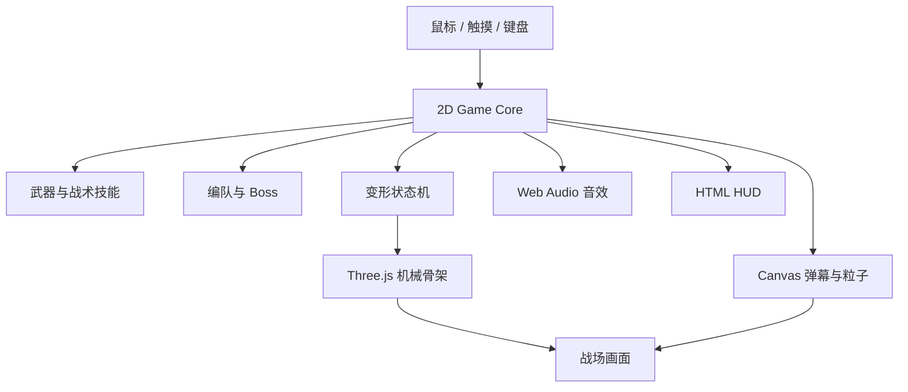

# 鼠标突击队

[](https://github.com/Ally1212/mouse-strike/actions/workflows/ci.yml)

一款以鼠标跟随操控、主动机械变形和高密度清屏为核心的浏览器纵向射击游戏。

玩家从六架战机中选择机体，开局即获得五向主炮和满变形能量。战斗中可以切换飞行/强袭机甲形态、释放机型专属战术技能、拆解 Boss 武器舱，并在每次 Boss 战后继续构筑火力。


## 核心特色

- **机械变形**：机鼻、胸甲、主翼、引擎、尾翼、肩甲、双臂武器和能量核心连续重组。
- **双形态战斗**：飞行形态强调机动和集中火力，强袭机甲强调范围输出与装甲吸收。
- **六种完整流派**：每架战机拥有独立被动、数值曲线、弹道、战术技能、变形时长和 3D 机械骨架。
- **高火力开局**：不从弱小状态起步，默认使用 LV.3 五向主炮并获得短时火力增幅。
- **专属战场构筑**：击毁 Boss 后出现当前战机独有的三个模块，不同机型构筑方向不会复用。
- **可破坏 Boss**：左右武器舱拥有独立生命值，摧毁后会削弱后续弹幕。
- **程序化音效**：射击、变形、清屏、部件破坏和 Boss 阶段均有独立 Web Audio 反馈。
- **移动端支持**：支持触摸跟随和专用的“变形”“战术”按钮。

## 操作方式

| 操作 | 键鼠 | 移动端 |
| --- | --- | --- |
| 移动战机 | 移动鼠标 | 拖动手指 |
| 自动射击 | 无需按键 | 无需按键 |
| 切换形态 | 鼠标左键 / `Space` | “变形”按钮 |
| 战术技能 | 鼠标右键 / `E` | “战术”按钮 |
| 返回机库 | `Q` | 结算或浏览器返回操作 |

强袭形态持续消耗变形能量。能量不足时战机会自动恢复飞行形态；强袭形态受击时优先消耗能量触发装甲吸收。

## 可选战机

| 国家代码 | 战机 | 核心玩法 | 被动 | 战术能力 |
| --- | --- | --- | --- | --- |
| USA | F-22 Raptor | 标记猎杀 | 追踪弹标记目标 | 处决全部标记单位并释放导弹群 |
| GBR | Eurofighter Typhoon | 纵向贯穿 | 轨道弹连续贯穿并叠加伤害 | 展开多轨风暴长矛 |
| FRA | Dassault Rafale | 共振覆盖 | 波动弹累计命中后范围爆炸 | 双相波动炮阵交汇爆破 |
| SWE | JAS 39 Gripen | 擦弹超频 | 近距离避开敌弹获得能量和射速 | 无人翼高速轨道齐射 |
| RUS | Sukhoi Su-57 | 装甲反击 | 吸收伤害并储存反击能量 | 将蓄能转化为重型爆破弹 |
| CHN | Chengdu J-20 | 蜂群指挥 | 无人翼优先锁定精英和 Boss | 集中释放高覆盖追踪蜂群 |

真实战机名称用于区分视觉和玩法风格。游戏数值、武器和机械形态均为虚构设计，不代表现实装备性能或国家间排名。

## 本地运行

环境要求：Node.js `20.19+` 或 `22.12+`。

```bash
npm install
npm run dev
```

默认开发地址由 Vite 输出。指定端口运行：

```bash
npm run dev -- --port 4174
```

生产构建：

```bash
npm run build
```

## 测试

```bash
# 玩法规则单元测试
npm test

# 六机选择、四种预览、左右键、专属模块和 Canvas 降级测试
npm run test:e2e
```

Playwright 首次运行前需要安装 Chromium：

```bash
npx playwright install chromium
```

## 技术架构



- Three.js 负责 3D 机库、机械骨架、Boss、材质、灯光和 Bloom。
- Canvas 负责高密度弹幕、敌机、粒子、飘字和碰撞反馈。
- 游戏判定保持在二维坐标系中，避免视觉升级破坏射击手感。
- 使用 `?renderer=canvas` 可以强制进入 Canvas 降级模式。
- 音频上下文只在用户首次交互后创建，符合浏览器自动播放限制。

## 项目结构

```text
mouse-strike/
├── index.html                 页面结构与 HUD
├── styles.css                机库、战场与响应式样式
├── game.js                   游戏循环、输入、战斗和状态管理
├── fighter-profiles.js       六架战机属性、被动、骨架和专属模块配置
├── fighter-rig.js            Three.js 机械战机与 Boss 渲染
├── gameplay-rules.js         可测试的变形、战术和编队规则
├── audio.js                  程序化 Web Audio 音效
├── tests/                    Vitest 单元测试
├── e2e/                      Playwright 交互测试
├── REQUIREMENTS.md           完整产品需求和验收标准
└── THIRD_PARTY_NOTICES.md    第三方许可证说明
```

## 设计与版权边界

- 不包含任天堂、Konami、《魂斗罗》或《变形金刚》的原始音频、角色、Logo、模型或动画资产。
- 机械重组、战机部件结构和音效参数均为本项目原创实现。
- 音效合成逻辑基于 MIT 许可的 ZzFX。
- 3D 渲染使用 MIT 许可的 Three.js。
- 第三方许可证详见 [THIRD_PARTY_NOTICES.md](THIRD_PARTY_NOTICES.md)。
- 当前仓库未声明项目级开源许可证，未经授权不自动授予复制、修改或再发布权利。

完整玩法规则、数值和验收标准见 [REQUIREMENTS.md](REQUIREMENTS.md)。
