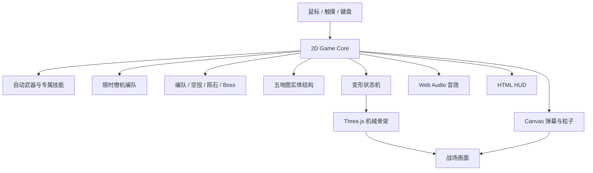

# 鼠标突击队

[](https://github.com/Ally1212/mouse-strike/actions/workflows/ci.yml)
[](https://github.com/Ally1212/mouse-strike/actions/workflows/deploy-pages.yml)

当前版本：`2.1.3`

在线试玩：<https://ally1212.github.io/mouse-strike/>

一款以鼠标跟随操控、左键切换攻击形态、右键消耗能量球限时变形和空格僚机支援为核心的浏览器纵向射击游戏。

玩家在单屏部署台中选择九架差异化战机。普通战机拥有 3 种攻击形态，概念机“超音速 X-10”拥有 10 种攻击形态；它可以自由查看，只有点击驾驶出击时才验证概念暗号。收集并消耗 3 个红色能量球后可变身 10 秒，游戏默认以窗口模式进入美国领空。


## 核心特色

- **九套变形骨架**：超音速 X-10 使用蓝白金英雄装甲、渐次冠翼、三引擎、超维核心、核武挂载、棱镜环与终焉光矛；歼-20 在强袭阶段展开红金龙脊、七段指挥冠与无人翼阵列。
- **飞行态识别件**：每架战机在未变形时也有专属轮廓，例如歼-20 的细长机鼻、鸭翼和扁平隐身进气道，F/A-XX 的无垂尾翼身，以及 Typhoon 的长矛中轴。
- **多攻击形态**：左键循环攻击形态，普通机 3 种，超音速 X-10 具有 10 种脉冲、追踪、波动、轨束、重炮、无人翼和激光弹道。
- **强化激光系统**：九架战机均拥有至少一种独立光束武器，包含预热、持续伤害、五层灼烧、破墙、自动冷却和过热停火；强袭态激光技能会升级为全屏扫射。
- **专属主动技能**：九架战机分别使用追踪猎杀、轨道炮阵、共振波、重型爆破和全屏激光阵列等技能，由 `E` 触发并拥有独立冷却。
- **双形态战斗**：飞行形态强调机动和集中火力，强袭机甲强调范围输出与装甲吸收。
- **九套僚机编队**：`Space` 召唤限时支援，超音速 X-10 使用三机光子圣翼队并发射贯穿激光。
- **九种完整流派**：每架战机拥有独立被动、数值曲线、弹道、专属技能、耐久上限和 3D 机械骨架。
- **纸面互联网游戏界面**：整体参考 AgenTank 的复古纸面语言，并用 OpenDesign `designstripe` 的衬线标题、等宽标签和克制排版统一机库、规则、战斗 HUD 与结算页。
- **完整战机图**：六架现实机型使用 Wikimedia Commons 开放授权图片，歼-35与 F/A-XX 使用项目原创程序化飞行渲染，全部保留完整轮廓与安全留白。
- **清晰高火力开局**：默认以 LV.3 进入战斗，但前 5 秒限制为可辨认的基础弹道，随后逐步开放弹体、敌方火力、升级补给和僚机，35 秒后进入完整压力。
- **五个短副本**：战斗中依次出现云端过山车、连续穿环、航母停靠、母舰破袭和连锁爆破。每次先暂停展示规则，玩家确认后才开始，也可本局跳过。
- **高压敌方弹幕**：新增狙击机、轰炸机、布雷机和分裂机，敌人会发射瞄准弹、扇形弹、针弹、爆裂弹、延迟雷和分裂弹。
- **五张实体战区**：美国领空、太平洋风暴线、北极光走廊、天穹回廊和陨星禁区均有不可穿越墙体、移动结构、能源门、危险区域或可破坏航路。
- **陨石事件**：落点提前预警，陨石能伤害玩家、敌机和结构；大型陨石需要激光、轨炮或重炮击碎，并掉落陨星核心。
- **战术空投决策**：击落运输机后接近补给箱，可立即在生存补给和火力超载中二选一，也可先护送 6 秒升级奖励；护送时敌机会转火补给箱。
- **敌军空中编队**：新增高速截击机与武装直升机，分别使用俯冲针弹和双发火箭，并保留八类原有敌机与三阶段 Boss。
- **六类战术补给**：红球积累变身能量，紫球推动机体进化，蓝球增强弹道，绿球恢复耐久护盾，金球展开大型圆弧屏障，青球召唤有独立生命值的友军双机。
- **差异化耐久**：右上角持续显示当前耐久、机型最大耐久和护盾层；九架战机的耐久上限各不相同。
- **无中断 Boss 奖励**：击毁 Boss 后立即补满 3 个红球、重置僚机冷却、恢复耐久与护盾并获得 6 秒极限火力。
- **可破坏 Boss**：左右武器舱拥有独立生命值，摧毁后会削弱后续弹幕。
- **街机战斗声场**：射击、变形、清屏、核爆、部件破坏和 Boss 阶段均有独立 Web Audio 反馈，并使用 CC0 的 Famitracker 高速战斗循环音乐。
- **移动端支持**：支持触摸跟随和专用的“技能”“变形”“僚机”按钮。

## 操作方式

| 操作 | 键鼠 | 移动端 |
| --- | --- | --- |
| 移动战机 | 移动鼠标 | 拖动手指 |
| 自动射击 | 无需按键 | 无需按键 |
| 切换攻击形态 | 鼠标左键 | “形态”按钮 |
| 专属必杀 | `E` | 键盘操作 |
| 消耗 3 球变身 10 秒 | 鼠标右键 | “变形”按钮 |
| 召唤僚机 | `Space` | “僚机”按钮 |
| 返回机库 | `Q` | 结算或浏览器返回操作 |

强袭形态必须先收集 3 个能量球，启动时一次性消耗，固定持续 10 秒并自动复原。超音速 X-10 会在这 10 秒内依次进入“极速破界、棱镜猎杀、泰坦重装、光子天神”四个阶段。

收集满 3 个红色能量球后，战场中央会显示大型“按鼠标右键变身”提示；系统不会自动变身。紫、蓝、绿三类球分别负责机体进化、弹道升级和耐久护盾。金球在机头前展开 8 秒大型圆弧屏障并抵消所有攻击，青球召唤两架各有 48 耐久的常驻友军，陨星核心在能量未满时补球、能量已满时提供 5 秒贯穿火力。

## 战斗副本

副本不增加新按键。场景到来时普通战斗暂停，规则卡会显示成功条件与奖励；点击“进入副本”后继续使用鼠标移动和自动射击，点击“本局跳过”则直接返回主战场。

| 副本 | 触发时间 | 使用方法 | 主要奖励 |
| --- | ---: | --- | --- |
| 云端过山车 | 约 12 秒 | 经历弹射、急降、S 弯和螺旋，仅用鼠标修正发光轨道 | 1000 分、5 秒极限火力 |
| 连续穿环 | 约 38 秒 | 移动战机依次穿过 5 个能量环 | 每环 300 分，全连补 1 球 |
| 航母停靠 | 约 68 秒 | 飞入黄色甲板区域并保持 2 秒 | 修复 35%、补球、僚机就绪、弹射强化 |
| 母舰破袭 | 约 100 秒 | 对准三个发光武器舱持续射击 | 2400 分、清弹、补满变身球 |
| 连锁爆破 | 约 132 秒 | 击中红色能源罐触发邻近连爆 | 连爆得分，5 连以上获得 7 秒屏障 |

## 敌人与 Boss

| 类型 | 作用 | 弹幕 |
| --- | --- | --- |
| 高速突击机 | 快速击破、维持连击 | 无主动弹幕 |
| 双炮战舰 | 压制走位 | 双发瞄准弹 |
| 旋转弹幕机 | 封锁横向空间 | 扇形弯曲弹 |
| 狙击机 | 惩罚直线移动 | 高速针弹 |
| 轰炸机 | 制造爆点压力 | 五连重型炮弹 |
| 布雷机 | 延迟区域封锁 | 延迟爆裂雷 |
| 分裂机 | 逼迫预判走位 | 三连分裂弹 |
| 高速截击机 | 快速换边突袭 | 三连高速针弹 |
| 武装直升机 | 慢速封锁航道 | 双发火箭加延迟雷 |
| 重装精英 | 高价值目标 | 三向弹加环形弹 |

首个 Boss 在第 4 波出现，此后每 4 波压上来，拥有三阶段变形和可破坏左右武器舱。击毁后直接发放“王牌补给”，战斗保持连续。

## 可选战机

| 国家 | 战机 | 核心玩法 | 被动 | 战术能力 |
| --- | --- | --- | --- | --- |
| 概念 | 超音速 X-10 | 英雄级十形态主宰 | 激光秒杀普通敌机并重创 Boss | 天穹核裁决 / 强袭全屏光阵 |
| 中国 | 歼-20 威龙 | 蜂群指挥 | 无人翼优先锁定精英和首领 | 集中释放高覆盖追踪蜂群 |
| 中国 | 歼-35 鹘鹰 | 双刃突击 | 追踪弹建立双线标记 | 本体与僚机连续截击标记目标 |
| 美国 | F/A-XX 白隼 | 僚机制空 | 僚机复制当前弹道 | 三线航路同步合围 |
| 美国 | F-22 猛禽 | 标记猎杀 | 追踪弹标记目标 | 处决全部标记单位并释放导弹群 |
| 英国 | 欧洲战斗机 台风 | 纵向贯穿 | 轨道弹连续贯穿并叠加伤害 | 展开多轨风暴长矛 |
| 法国 | 达索 阵风 | 共振覆盖 | 波动弹累计命中后范围爆炸 | 双相波动炮阵交汇爆破 |
| 瑞典 | JAS 39 鹰狮 | 擦弹超频 | 近距离避开敌弹获得能量和射速 | 无人翼高速轨道齐射 |
| 俄罗斯 | 苏霍伊 Su-57 | 装甲反击 | 吸收伤害并储存反击能量 | 将蓄能转化为重型爆破弹 |

真实战机名称用于区分视觉和玩法风格。游戏数值、武器和机械形态均为虚构设计，不代表现实装备性能或国家间排名。

| 战机 | 强袭形态 | 启动条件 | 持续时间 |
| --- | --- | ---: | ---: |
| 超音速 X-10 | 超维天神 | 3 球 | 10s |
| 全部普通战机 | 各机专属形态 | 3 球 | 10s |

超音速 X-10 位于战机列表末尾，模型和属性可自由预览。这不是付费内容；每次点击“驾驶出击”都必须输入概念暗号 `0000`，验证成功后自动进入战斗，退出后再次驾驶仍需重新验证。该机制仅用于隐藏玩法体验，并不等同于服务端安全授权。

## 本地运行

环境要求：Node.js `20.19+` 或 `22.12+`。

```bash
npm install
npm run dev
```

默认开发地址由 Vite 输出。指定端口运行：

```bash
npm run dev -- --port 4174
```

生产构建：

```bash
npm run build
```

## 免费部署

项目已配置 GitHub Pages 免费部署。推送到 `main` 后，`.github/workflows/deploy-pages.yml` 会自动执行：

```bash
npm ci
npm test
npm run build -- --base=/mouse-strike/
```

构建产物从 `dist/` 发布到：

```text
https://ally1212.github.io/mouse-strike/
```

如需改用 Vercel，项目本身是标准 Vite 静态站点，保持 `Build Command = npm run build`、`Output Directory = dist` 即可；当前本机 Vercel CLI 未登录，所以本次实际发布使用 GitHub Pages。

## 测试

```bash
# 玩法规则单元测试
npm test

# 桌面/移动端九机、三球变身、五地图、陨石、空投、强化激光、僚机和 Canvas 降级测试
npm run test:e2e
```

Playwright 首次运行前需要安装 Chromium：

```bash
npx playwright install chromium
```

## 技术架构



- Three.js 负责 3D 机库、机械骨架、Boss 和金属材质；机库使用明亮暖色环境与极低强度 Bloom，避免模型发灰或刺眼。
- Lucide 提供界面图标，保持声音、规则、预览和战斗按钮的视觉一致性。
- `img2threejs` 负责参考图探测、重建评估、细节清单、规格门禁和分阶段模型替换线路。
- Canvas 负责高密度弹幕、敌机、五地图结构、陨石、空投、粒子、飘字和全屏反馈。
- 游戏判定保持在二维坐标系中，避免视觉升级破坏射击手感。
- 使用 `?renderer=canvas` 可以强制进入 Canvas 降级模式。
- 音频上下文只在用户首次交互后创建，符合浏览器自动播放限制。
- 战斗音乐使用 Ted Kerr 的 CC0 曲目 [8-bit Theme - On The Offensive](https://opengameart.org/content/8-bit-theme-on-the-offensive)，详细许可见 `public/audio/README.md`；未使用《魂斗罗》等商业游戏原始音频。

## 项目结构

```text
mouse-strike/
├── index.html                 页面结构与 HUD
├── styles.css                机库、战场与响应式样式
├── paper-theme.css           AgenTank / OpenDesign 纸面主题覆盖层
├── game.js                   游戏循环、输入、战斗和状态管理
├── battle-maps.js            五张战区、实体结构、危险区域和碰撞解析
├── fighter-profiles.js       九架战机属性、攻击形态、骨架和僚机配置
├── public/fighters/          网页使用的战机 WebP 缩略图
├── references/fighters/      img2threejs 使用的原始参考图
├── model-pipeline/           分机型重建评估、规格和质量门禁产物
├── fighter-rig.js            Three.js 机械战机与 Boss 渲染
├── gameplay-rules.js         可测试的武器、变形时限、技能、僚机和编队规则
├── audio.js                  程序化 Web Audio 音效
├── tests/                    Vitest 单元测试
├── e2e/                      Playwright 交互测试
├── REQUIREMENTS.md           完整产品需求和验收标准
└── THIRD_PARTY_NOTICES.md    第三方许可证说明
```

## 设计与版权边界

- 不包含任天堂、Konami、《魂斗罗》或《变形金刚》的原始音频、角色、Logo、模型或动画资产。
- 机械重组、战机部件结构和音效参数均为本项目原创实现。
- 音效合成逻辑基于 MIT 许可的 ZzFX。
- 3D 渲染使用 MIT 许可的 Three.js。
- 界面图标使用 ISC 许可的 Lucide。
- 第三方许可证详见 [THIRD_PARTY_NOTICES.md](THIRD_PARTY_NOTICES.md)。
- 战机参考图作者与许可证详见 [docs/FIGHTER_IMAGE_CREDITS.md](docs/FIGHTER_IMAGE_CREDITS.md)。
- 当前仓库未声明项目级开源许可证，未经授权不自动授予复制、修改或再发布权利。

完整玩法规则、数值和验收标准见 [REQUIREMENTS.md](REQUIREMENTS.md)。
