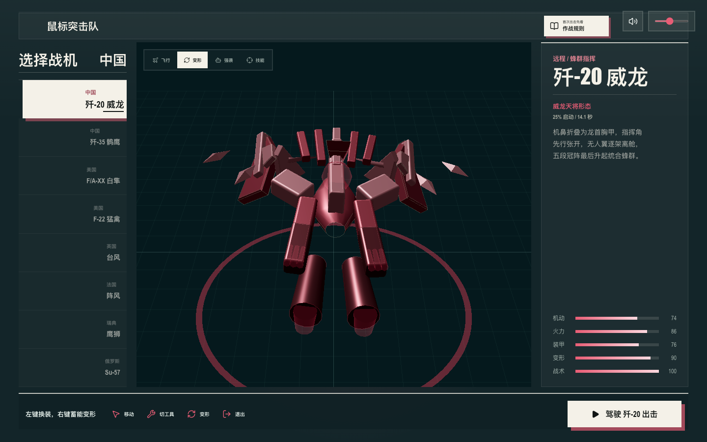
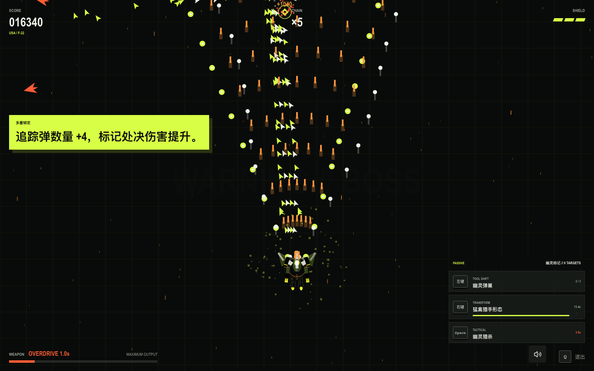
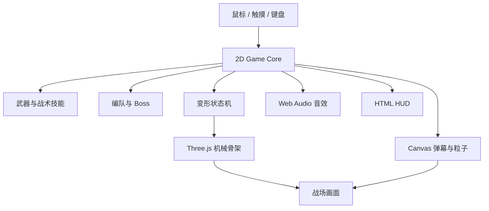

# 鼠标突击队

[](https://github.com/Ally1212/mouse-strike/actions/workflows/ci.yml)
[](https://github.com/Ally1212/mouse-strike/actions/workflows/deploy-pages.yml)

当前版本：`2.1.0`

在线试玩：<https://ally1212.github.io/mouse-strike/>

一款以鼠标跟随操控、三工具换装、限时机械变形和高密度清屏为核心的浏览器纵向射击游戏。

玩家在单屏部署台中选择八架差异化战机，开局即获得等级 3 主炮和满变形能量。左键循环切换三种专属工具，右键在能量达标后进入限时强袭形态，`Space` 释放战术技能。





## 核心特色

- **八套变形骨架**：歼-20 指挥、歼-35 双刃、F/A-XX 僚机、F-22 猎手、台风枪骑、阵风炽翼、鹰狮独驱和 Su-57 攻城形态拥有不同部件层级与轮廓。
- **三工具换装**：每架战机有三种可实时切换的工具形态，弹体、射速、伤害、扩散角和 3D 武器附件同步变化。
- **双形态战斗**：飞行形态强调机动和集中火力，强袭机甲强调范围输出与装甲吸收。
- **八种完整流派**：每架战机拥有独立被动、数值曲线、弹道、战术技能、变形时长和 3D 机械骨架。
- **单屏部署台**：选机、3D 预览、核心机制、属性和出击入口集中在一个视口，详细规则按需展开。
- **完整战机图**：六架现实机型使用 Wikimedia Commons 开放授权图片，歼-35与 F/A-XX 使用项目原创程序化飞行渲染，全部保留完整轮廓与安全留白。
- **高火力开局**：不从弱小状态起步，默认使用 LV.3 五向主炮并获得短时火力增幅。
- **专属战场构筑**：击毁 Boss 后出现当前战机独有的三个模块，不同机型构筑方向不会复用。
- **可破坏 Boss**：左右武器舱拥有独立生命值，摧毁后会削弱后续弹幕。
- **程序化音效**：射击、变形、清屏、部件破坏和 Boss 阶段均有独立 Web Audio 反馈。
- **移动端支持**：支持触摸跟随和专用的“工具”“变形”“战术”按钮。

## 操作方式

| 操作 | 键鼠 | 移动端 |
| --- | --- | --- |
| 移动战机 | 移动鼠标 | 拖动手指 |
| 自动射击 | 无需按键 | 无需按键 |
| 切换工具 | 鼠标左键 | “工具”按钮 |
| 限时变形 | 鼠标右键 | “变形”按钮 |
| 战术技能 | `Space` / `E` | “战术”按钮 |
| 返回机库 | `Q` | 结算或浏览器返回操作 |

强袭形态必须达到机型自身的最低能量门槛才能启动。满能量持续时间为 `10.4–15.4` 秒，耗尽后自动复原；强袭受击时优先消耗能量触发装甲吸收。

## 可选战机

| 国家 | 战机 | 核心玩法 | 被动 | 战术能力 |
| --- | --- | --- | --- | --- |
| 中国 | 歼-20 威龙 | 蜂群指挥 | 无人翼优先锁定精英和首领 | 集中释放高覆盖追踪蜂群 |
| 中国 | 歼-35 鹘鹰 | 双刃突击 | 追踪弹建立双线标记 | 本体与僚机连续截击标记目标 |
| 美国 | F/A-XX 白隼 | 僚机制空 | 僚机复制当前弹道 | 三线航路同步合围 |
| 美国 | F-22 猛禽 | 标记猎杀 | 追踪弹标记目标 | 处决全部标记单位并释放导弹群 |
| 英国 | 欧洲战斗机 台风 | 纵向贯穿 | 轨道弹连续贯穿并叠加伤害 | 展开多轨风暴长矛 |
| 法国 | 达索 阵风 | 共振覆盖 | 波动弹累计命中后范围爆炸 | 双相波动炮阵交汇爆破 |
| 瑞典 | JAS 39 鹰狮 | 擦弹超频 | 近距离避开敌弹获得能量和射速 | 无人翼高速轨道齐射 |
| 俄罗斯 | 苏霍伊 Su-57 | 装甲反击 | 吸收伤害并储存反击能量 | 将蓄能转化为重型爆破弹 |

真实战机名称用于区分视觉和玩法风格。游戏数值、武器和机械形态均为虚构设计，不代表现实装备性能或国家间排名。

| 战机 | 强袭形态 | 最低启动能量 | 满能量持续 |
| --- | --- | ---: | ---: |
| 歼-20 | 威龙天将 | 25% | 14.1s |
| 歼-35 | 鹘鹰双刃 | 22% | 14.6s |
| F/A-XX | 白隼双生 | 28% | 13.2s |
| F-22 | 猛禽猎手 | 24% | 13.5s |
| Typhoon | 风暴枪骑 | 27% | 12.2s |
| Rafale | 双相炽翼 | 26% | 12.8s |
| Gripen | 北境独驱 | 20% | 15.4s |
| Su-57 | 破城重兽 | 32% | 10.4s |

## 本地运行

环境要求：Node.js `20.19+` 或 `22.12+`。

```bash
npm install
npm run dev
```

默认开发地址由 Vite 输出。指定端口运行：

```bash
npm run dev -- --port 4174
```

生产构建：

```bash
npm run build
```

## 免费部署

项目已配置 GitHub Pages 免费部署。推送到 `main` 后，`.github/workflows/deploy-pages.yml` 会自动执行：

```bash
npm ci
npm test
npm run build -- --base=/mouse-strike/
```

构建产物从 `dist/` 发布到：

```text
https://ally1212.github.io/mouse-strike/
```

如需改用 Vercel，项目本身是标准 Vite 静态站点，保持 `Build Command = npm run build`、`Output Directory = dist` 即可；当前本机 Vercel CLI 未登录，所以本次实际发布使用 GitHub Pages。

## 测试

```bash
# 玩法规则单元测试
npm test

# 八机选择、独立 Rig 签名、工具换装、能量变形、专属模块和 Canvas 降级测试
npm run test:e2e
```

Playwright 首次运行前需要安装 Chromium：

```bash
npx playwright install chromium
```

## 技术架构



- Three.js 负责 3D 机库、机械骨架、Boss、材质、克制的边缘能量光和选择性 Bloom。
- Lucide 提供界面图标，保持声音、规则、预览和战斗按钮的视觉一致性。
- `img2threejs` 负责参考图探测、重建评估、细节清单、规格门禁和分阶段模型替换线路。
- Canvas 负责高密度弹幕、敌机、粒子、飘字和碰撞反馈。
- 游戏判定保持在二维坐标系中，避免视觉升级破坏射击手感。
- 使用 `?renderer=canvas` 可以强制进入 Canvas 降级模式。
- 音频上下文只在用户首次交互后创建，符合浏览器自动播放限制。

## 项目结构

```text
mouse-strike/
├── index.html                 页面结构与 HUD
├── styles.css                机库、战场与响应式样式
├── game.js                   游戏循环、输入、战斗和状态管理
├── fighter-profiles.js       八架战机属性、被动、骨架和专属模块配置
├── public/fighters/          网页使用的战机 WebP 缩略图
├── references/fighters/      img2threejs 使用的原始参考图
├── model-pipeline/           分机型重建评估、规格和质量门禁产物
├── fighter-rig.js            Three.js 机械战机与 Boss 渲染
├── gameplay-rules.js         可测试的工具、变形时限、战术和编队规则
├── audio.js                  程序化 Web Audio 音效
├── tests/                    Vitest 单元测试
├── e2e/                      Playwright 交互测试
├── REQUIREMENTS.md           完整产品需求和验收标准
└── THIRD_PARTY_NOTICES.md    第三方许可证说明
```

## 设计与版权边界

- 不包含任天堂、Konami、《魂斗罗》或《变形金刚》的原始音频、角色、Logo、模型或动画资产。
- 机械重组、战机部件结构和音效参数均为本项目原创实现。
- 音效合成逻辑基于 MIT 许可的 ZzFX。
- 3D 渲染使用 MIT 许可的 Three.js。
- 界面图标使用 ISC 许可的 Lucide。
- 第三方许可证详见 [THIRD_PARTY_NOTICES.md](THIRD_PARTY_NOTICES.md)。
- 战机参考图作者与许可证详见 [docs/FIGHTER_IMAGE_CREDITS.md](docs/FIGHTER_IMAGE_CREDITS.md)。
- 当前仓库未声明项目级开源许可证，未经授权不自动授予复制、修改或再发布权利。

完整玩法规则、数值和验收标准见 [REQUIREMENTS.md](REQUIREMENTS.md)。
