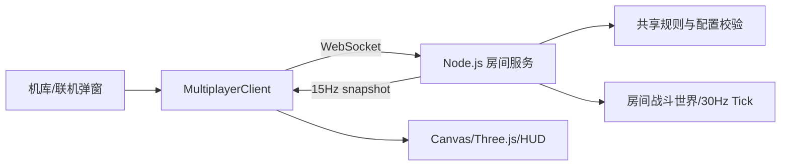

# 好友联机技术设计文档

## 1. 设计目标

在现有 Vite 前端、Node.js `ws` 服务和 `multiplayer-rules.js` 基础上，提供两人实时联机。目标是服务端权威、公平可验证、弱网可恢复，同时让客户端保持鼠标跟手。

## 2. 系统架构



- `multiplayer-client.js`：连接、会话 token、消息分发、输入节流和重连。
- `server.mjs`：房间生命周期、玩家输入、战斗世界、胜负与广播。
- `multiplayer-rules.js`：房间码、配置归一化、昵称和输入校验；客户端与服务端共用。
- 房间仅保存在服务端内存；服务重启不保证恢复。

## 3. 状态机

客户端状态：`idle → connecting → lobby → ready → playing → roundEnd/matchEnd → lobby`；任何阶段可进入 `error`，用户确认后回到 `idle`。

服务端房间状态：`lobby → playing → finished`。玩家状态包含 `connected`、`ready`、`fighterId`、`token` 和断线时间。房主断线期间保留房主身份；超过 30 秒则转移给在线玩家。

开战条件：房间恰有 2 人、两人在线、两人 ready、配置已归一化。1v1 开战后配置只读。

## 4. 数据模型

```js
Room {
  roomCode, mode, hostId, status,
  config, players[], world, createdAt, lastTick
}
Player {
  id, token, nickname, fighterId,
  ready, connected, disconnectedAt,
  input, sim, score, roundWins
}
```

`token` 仅用于当前页面会话重连，不代表账号授权；昵称统一空白折叠并截断至 16 字符。房间码使用不含易混淆字符的五位大写字母/数字。

## 5. WebSocket 协议

客户端请求统一为 `{ type, payload }`。服务端响应统一包含 `type`，失败消息为 `{ type: "error", code, message }`。

| 请求 | 关键字段 | 处理 |
| --- | --- | --- |
| `createRoom` | `nickname, mode, fighterId, config` | 创建房间并返回 token |
| `joinRoom` | `roomCode, nickname, mode, fighterId` | 校验房间并加入 |
| `reconnect` | `roomCode, token` | 30 秒窗口内恢复连接 |
| `selectFighter` | `fighterId` | 校验模式可用性并取消 ready |
| `updateConfig` | `config` | 仅房主可用，归一化并取消双方 ready |
| `ready` | `ready: boolean` | 满足开战条件后启动 |
| `input` | `x, y, action` | 校验范围/白名单后写入最新输入 |
| `leave` | 无 | 离开房间并清理会话 |

服务端事件：`joined`、`lobby`、`matchStart`、`snapshot`、`roundEnd`、`matchEnd`、`error`。`snapshot` 包含服务器时间、模式、回合、剩余时间、事件、敌人、弹体、补给和双方公开状态；不下发 token 或内部判定字段。

## 6. 同步策略

- 服务端逻辑 tick 固定 30Hz，战斗快照广播 15Hz；每帧只保留玩家最新输入，防止输入队列积压。
- 客户端对本机位置做预测，对远端玩家和世界实体插值；收到快照后采用短时平滑校正，误差超过阈值时硬校正。
- 命中、伤害、掉落、救援完成、合击触发、回合胜负全部由服务端计算；客户端输入不得携带伤害或位置结果。
- 输入 `x/y` 限制在 `[0,1]`，动作限制为 `tool/transform/wingman/tactical/revive`；输入频率由客户端约 45ms 节流，服务端仍需限频。
- 可选增加 `seq` 和 `clientTime` 字段用于诊断丢包与延迟；未知字段忽略以保持向后兼容。

## 7. 核心玩法实现

### 合作远征

- 两名玩家均在线且未倒地、距离小于 120 时，`link` 以 4.5/s 增长。
- 任一玩家倒地时，另一名玩家在其附近持续输入 `revive`；达到 2 秒后恢复 42% 耐久、获得 1.5 秒无敌并增加 25 合击能量。
- `link >= 100` 且双方在 1 秒内都触发战术动作时，清除敌弹、击杀/重创敌人并重置能量。
- 服务端在每次快照中下发队友生命、倒地、救援进度和合击能量，客户端只负责表现。

### 1v1 规则工坊

- `normalizeMatchConfig` 对地图、回合、时长、耐久、武器、补给、冷却和胜利条件做白名单归一化。
- `isDuelFighterAllowed` 排除概念机与 AI 原型机；服务端再次校验，不能只依赖 UI。
- 回合结束后广播 `roundEnd`，短暂延迟后重置世界；达到 `roundsToWin` 后广播 `matchEnd`。
- 补给刷新由服务端随机种子/时间驱动，位置避开出生区和不可通行结构；客户端不生成实体。

## 8. 连接、错误与安全

- 连接超时 4.5 秒；关闭事件更新 UI 状态但不立即销毁玩家，保留 30 秒重连窗口。
- 房间满、配置非法、无权限更新、未知房间、重连超时分别返回稳定错误码，前端映射为中文可行动提示。
- 限制单消息大小、JSON 解析失败直接丢弃、动作和数值全部白名单校验；昵称做文本清洗，禁止 HTML 注入。
- 生产部署使用 `wss`、反向代理心跳和连接数/房间数限额；首版不保存个人资料。

## 9. 测试与验收

- 单元测试：房间码生成、昵称清洗、配置归一化、输入校验、回合/胜负、救援/合击边界。
- WebSocket 集成测试：双客户端完整建房、加入、准备、开战、快照、回合、结算、重连和房主转移。
- E2E：桌面 Chrome/Edge 合作与 1v1 主流程、非法操作提示、规则修改后重新准备、结算返回。
- 弱网测试：延迟 100–300ms、短暂断线、重复/超频输入、服务端不可用；确认不会错误判胜或卡死。
- 性能验收：两人满载战斗时服务端 tick 不持续超时，快照队列不增长，客户端渲染无明显抖动。

## 10. 部署与观测

- 本地：前端 `npm run dev`，联机服务 `npm run server`；通过 `VITE_GAME_SERVER_URL` 指定 `ws/wss` 地址。
- 记录连接成功率、房间创建/加入失败、平均快照间隔、重连成功率、异常码和房间峰值。
- 首版按小规模公网验证；达到容量阈值时优先限制新建房间并保留已有对局。

